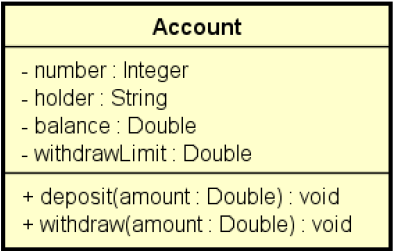

# Problema Exemplo

Exemplo didático para demonstrar o uso de Exceptions/Try-catch
  
Fazer um programa para ler os dados de uma conta bancária e depois realizar um saque nesta conta bancária, mostrando o novo saldo. Um saque não pode ocorrer ou se não houver saldo na conta, 
ou se o valor do saque for superior ao limite de saque da conta. Implemente a conta bancária conforme projeto abaixo:
  

  

Quando o valor do saque for maior que o limite de saque: "Withdraw error: The amount exceeds withdraw limit".
  
Quando o valor do saque for maior que o saldo da conta: "Withdraw error: Not enough balance".
